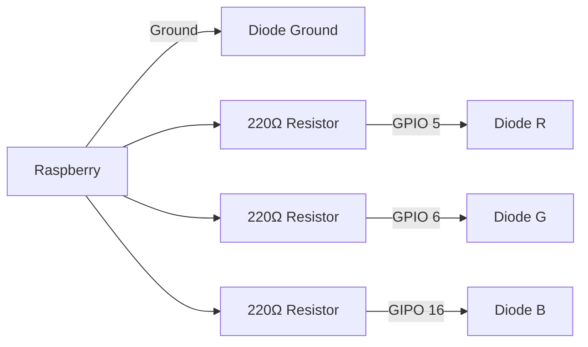

### Example connection and usage



### Requirements
- Node.js
- Installed `pigpio` with command `npm install pigpio`

### Code example
Import the RgbDiode class from library file.
```js
const RgbDiode = require("./lib/RgbDiode");
```

Initialize the diode with GPIO pins that will be controlling colors.
```js
const diode = new RgbDiode({
    r: 5, // GPIO 5
    g: 6, // GPIO 6
    b: 16 // GPIO 16
});
```

Set diode color in RGB format.
```js
diode.setRGB(255, 0, 0); // red color
```

Every second the color of the diode will be changed to next color in the list.
```js
diode.loop([
    { r: 255, g: 0, b: 0 },
    { r: 0, g: 255, b: 0 },
    { r: 0, g: 0, b: 255 },
], 1000)
```

Sends the (0, 0, 0) signal.
```js
diode.off()
```
